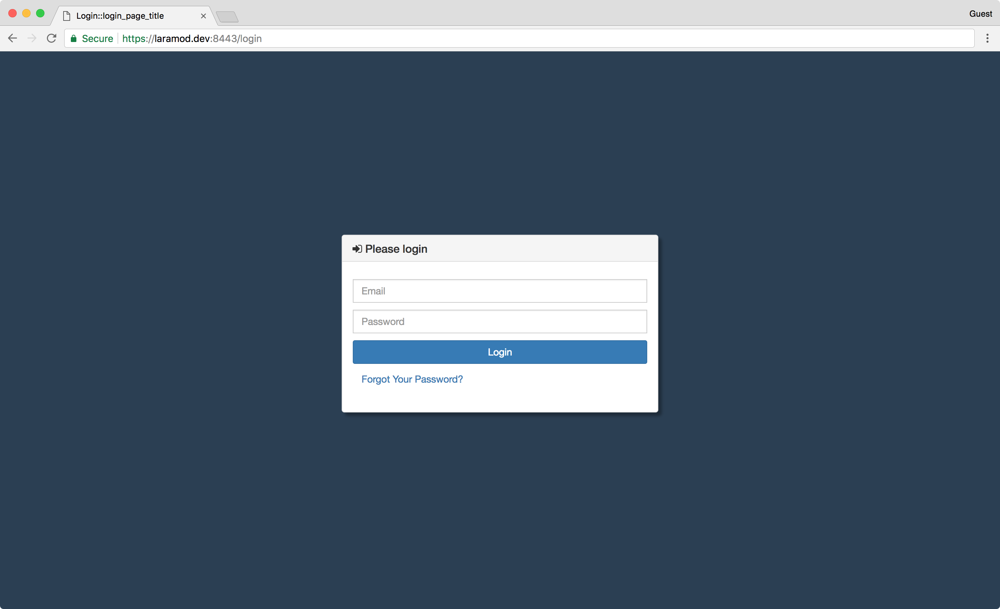

# LaraMod - Modularised Laravel

[](https://travis-ci.org/htr3n/laramod)
[](https://laravel.com)
[](https://php.net)
[](https://david-dm.org/htr3n/laramod)
[](https://david-dm.org/htr3n/laramod?type=dev)
[](https://snyk.io/test/github/htr3n/laramod?targetFile=package.json)
[](https://opensource.org/licenses/MIT)

**LaraMod** is another approach to a convention-based modularisation of a [Laravel](https://laravel.com)-based project. The idea stems from my struggle to organise a Laravel-based project such that I can work effectively and focus better on individual modules such as `UserManagement`, `Authentication`, `Dashboard`, etc. whilst keeping the Laravel code base as intact as possible (this would be convenient for upgrading Laravel) and keeping my code base separate from original Laravel's.

There are some other decent attempts on modalurasing Laravel projects for example [here](https://nicolaswidart.com/blog/writing-modular-applications-with-laravel-modules), [here](https://github.com/caffeinated/modules) or [here](http://kamranahmed.info/blog/2015/12/03/creating-a-modular-application-in-laravel). Being inspired and learning from these, I start a simple project on my own to dig a bit deeper into Laravel 5. Here I will mainly emphasize the modularisation part, the rest inherits from Laravel 5, so please refer to [Laravel's docs](https://laravel.com/docs).

## Quick Start

For the starting point, cloning `laramod` git repos

```sh
git clone https://github.com/htr3n/laramod.git
```

Then, go into the newly created folder and execute the following commands

```sh
composer install
npm install
npm run dev
```
 to retrieve and compile necessary packages for your development environment.

In case you want to test whether LaraMod is working, you can start the local development server via `php artisan` (note that we must set up the `.env` beforehand, for instance, copying the existing `.env.testing`, otherwise Laravel/Laramod will fail to run properly  with the error `500`).

```sh
cp .env.testing .env
php artisan serve
```

We should see a working web site at <http://127.0.0.1:8000>.

## Technical Details

### Conventional Module Structure

The convention of project structure modules in `LaraMod` is rather straightforward, but naive. The additional folder `modules` will be the base of the modules. At this release, only one module layer is supported.

```
Authentication
  |--Controllers
  |--Lang
  |--Migrations
  |--Models
  |--View
  |--routes.php
```

The meanings of the sub-folders can be easily guessed: `Models` is for the `M`,  `Views` is for the `V`, and `Controllers` is for the `C`, of MVC. `Lang` is for `i18n` and `l10n` (translation in Laravel), `Migrations` for database migration classes. Finally, the file `routes.php` defines the routes for `Authentication`.

The structure mentioned above can be quickly generated using the `artisan` command `gen:module` provided by the class `App\Console\Commands\GenModuleCommand`.

```sh
php artisan gen:module ModuleA
```

### Module Loading

The loading of a module and its subfolders are defined in `modules/ModulesServiceProvider.php`.

* First, try to load the modules using the config file `config/module.php`.

  ```php
  // an example of 'config/module.php'
  <?php
  return  [
      'modules' => [
          'Core',
          'Login',
          'Dashboard',
          'Home',
          'User',
      ]
  ];
  ```

* If `config/module.php` does not exist or contains no configuration, then `ModulesServiceProvider` will analyse and load the module based on the above conventional structure.

The class `ModulesServiceProvider` has then been added to `config/app.php`:

```php
    'providers' => [
       ...
       \Laramod\ModulesServiceProvider::class
    ]
```

### PSR-4 Autoloading

The PSR-4 autoloading of classes should be updated with the paths and namespaces to your modules accordingly. For instance,

```json
    "psr-4": {
      "App\\": "app/",
      "Core\\": "modules/Core/",
      "Dashboard\\": "modules/Dashboard/",
      "Login\\": "modules/Login/",
      "User\\": "modules/User/",
      "Laramod\\": "modules/"
    }
```

### Access to Module Parts

- Module's controllers, migrations and other classes are mostly PSR-4 autoloaded. Thus, they can be accessed straightforwardly.
- Access to views and international parts (`Lang`) of each module requires a slightly different syntax, for instance `ModuleA::blade_view_name` or `ModuleA::messages.title`. If the `ModuleA::` part is missing, Laravel will look for views and language files in the default places.
- The included example views are well organised into substructures of a typical Web site / dashboard, such as `nav_top`, `nav_left`.

### Caveats

* Stuffs for testing are still in `tests`.
* Database seeders are still in `database/seeds`.
* For a smoother integration and better compability of [Gentelella Admin](https://github.com/puikinsh/gentelella) (that includes Bootstrap and jQuery), LaraMod does not use any scafffolding (i.e. `php artisan preset none`)
* I developed some extra generators for handling modules as the original generators provide limited options for generated paths and namespaces and many others.
* To showcase the modularisation, I transformed the original Laravel's authentication part into a module, namely, `Login`, and updated relevant classes and traits, views and controllers.

### Extras

`LaraMod` also comes with other additions. I love the excellent [Laravel Debugbar](https://github.com/barryvdh/laravel-debugbar) for debugging and would like to have it in `LaraMod`:

```sh
composer require barryvdh/laravel-debugbar --dev
```

Besides, `LaraMod` embraces Twitter's [Bootstrap 3](http://getbootstrap.com) and [Gentelella Admin](https://github.com/puikinsh/gentelella). `LaraMod` might be used as a starting point for developing a dashboard application. Instead of using Laravel's scafffolding [Bootstrap](https://laravel.com/docs/frontend) and [jQuery](http://getbootstrap.com), I thought it would be wiser to use the third party plugins enclosed with `Gentelella` because they have been already tested working together.

*  `webpack.mix.js` defines rules for transforming and copying relevant scripts and styles.

This is how the Web application looks.




### Credits

* The excellent [Laravel](https://github.com/laravel/laravel) framework developed by [Taylor Otwell](mailto:taylor@laravel.com).
* The idea of modularisation implemented in LaraMod is inspired by Kamran Ahmed's excellent [post](http://kamranahmed.info/blog/2015/12/03/creating-a-modular-application-in-laravel/).
* The beautiful Gentelella Admin theme developed by [Aigars Silkalns (puikinsh)](https://github.com/puikinsh)
